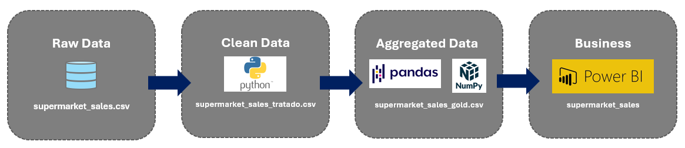

# 🛒 Projeto ETL - Análise de Vendas de Supermercado

##  Arquitetura do Pipeline

  

##  Objetivo do Projeto

O objetivo central deste projeto é transformar dados brutos de transações de uma rede de supermercados em uma base de dados inteligente e higienizada. 

Muitas vezes, dados transacionais vêm em formatos brutos (como strings ou formatos internacionais) que dificultam a análise imediata. Este projeto resolve esse problema ao:

1.  **Padronizar** a comunicação (tradução para PT-BR).
2.  **Enriquecer** os dados com colunas temporais (períodos, quinzenas, dias úteis).
3.  **Garantir a Integridade** através de uma auditoria de qualidade (limpeza de duplicatas e nulos).

O resultado final é um dataset pronto para alimentar Dashboards de BI, permitindo que gestores tomem decisões baseadas em fatos, como "qual o melhor horário para promoções relâmpago".

---

##  Etapas de Desenvolvimento (Workflow)

O projeto foi dividido em três marcos principais para garantir a organização e a reprodutibilidade da análise:

### Fase 1: Auditoria e Qualidade (Data Discovery)
Realizada no notebook `Final.ipynb`, esta etapa focou em entender a "saúde" dos dados:

* **Análise Exploratória Inicial (EDA):** Verificação de tipos de dados e estatísticas descritivas.
* **Sanitização:** Localização de valores ausentes (NaN) e remoção de registros duplicados que poderiam inflar os resultados financeiros.
* **Check de Consistência:** Verificação de outliers e inconsistências em colunas categóricas.

### Fase 2: Transformação e Feature Engineering (Data Wrangling)
No notebook `Tratamento.ipynb`, foi aplicado as regras de negócio para gerar valor:

* **Normalização de Schema:** Tradução completa de colunas e categorias para facilitar o uso por times locais.
* **Criação de Inteligência Temporal:** Desenvolvimento de funções em Python para extrair períodos do dia e classificar dias da semana.
* **Otimização de Tipagem:** Conversão de formatos de data e hora para objetos `datetime`, permitindo cálculos de séries temporais.

### Fase 3: Exportação e Preparação para Visualização

* **Geração do Dataset de Saída:** Consolidação de todas as transformações em um único arquivo `supermarket_sales_tratado.csv`.
* **Preparação para o Dashboard:** Organização dos dados para que ferramentas de visualização consigam ler as métricas de tempo sem necessidade de novos tratamentos.

---

##  Principais Métricas Criadas (KPIs)

* **Ticket Médio por Período:** Permite ver se as vendas da "Noite" são mais valiosas que as da "Manhã".
* **Volume por Quinzena:** Mostra a sazonalidade relacionada ao ciclo de pagamento dos consumidores.
* **Performance por Filial:** Comparativo direto de receita entre as unidades da rede.